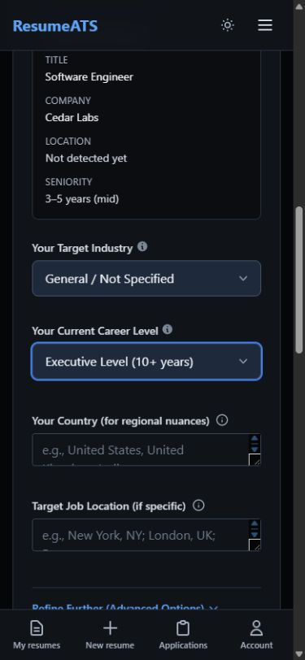
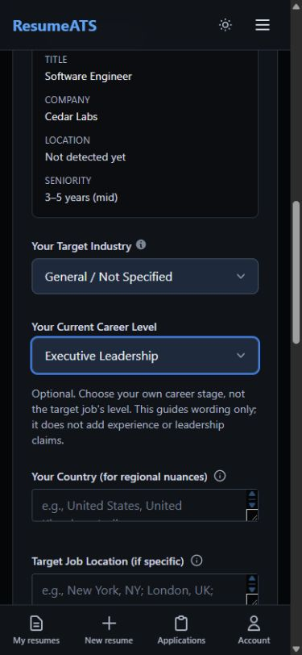
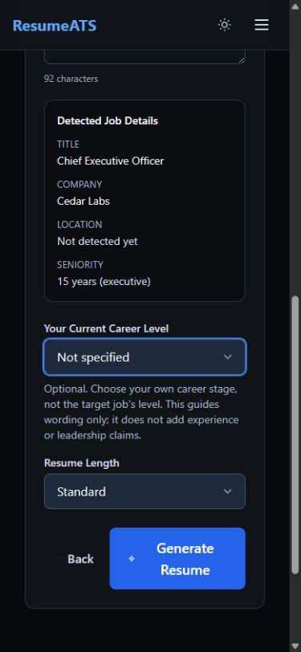

# Candidate evidence: career preferences and literal quantities

Status: local remediation; the takeover goal and separate release gates remain
open. No model, payment, employer, managed database or deployment was used in this
pass. Final combined results are recorded in the main verification ledger.

The frozen combined state passes **843/843 Node tests**, with zero skipped, global
lint, TypeScript, production build/prerender (1,204 modules), repository checks,
and Chrome/Firefox package builds. The separate strict factual diagnostic still
fails seven cases; it is not concealed by the default suite's green status.
The verified initial JavaScript closure is 675,283 raw / 202,021 gzip bytes,
2,535 gzip bytes above the handoff-only checkpoint and 39.46% below the original
baseline. A [separate asset snapshot](production-loading-after-candidate-evidence.json)
records this cost; no Core Web Vitals or device-speed claim is made.

## Career-level audit and repair

The two Import Latest Job handlers copied the target job's detected seniority
into the candidate's career-level control. An import finishing late could even
overwrite a candidate choice made while it was loading. The Enhanced options
also equated 10+ years with executive responsibility, while the generation prompt
contradicted its own tone-only instruction by asking that total years match the
selected level.

Both generators now start at **Not specified**. Existing valid saved preferences
are retained, imports update job details without changing candidate career level,
and the options no longer define responsibility by year thresholds. Quick Resume
uses the same option list, including Career Change. Visible help is linked to the
control with `aria-describedby`; it describes an optional wording preference, not
evidence of experience or leadership. The service defaults to a neutral,
allowlisted preference and explicitly forbids adding tenure, titles, authority or
qualifications to satisfy either that preference or the vacancy.

Four new lifecycle regressions failed before the fix. The fifth checks that the
new neutral default does not erase an existing saved preference. The actual
component callbacks cover all six choices, late imports and the exact option
passed to generation. Four separate tests inspect the actual bundled service's
outgoing prompt with an isolated provider stub, including an unknown option.
This verifies prompt construction, not how a live model follows it.

### Captured flow

1. **Enhanced career selector before repair — misleading.** At a 390px viewport,
   the displayed Executive Level option asserted a 10+ years threshold. The target
   job's detected seniority was displayed separately above it. The first capture
   attempt showed the top of the page rather than this control and was rejected.
   The accepted replacement is [capture 69](69-career-level-before.png).
2. **Enhanced selector after repair — clearer.** The same selected value now reads
   Executive Leadership, with visible wording-only help. Existing spacing, focus
   styling and color system are retained. The before/after screenshots were
   inspected together; the document and scroll widths were both 375px within the
   390px viewport, with no horizontal overflow.
   [Capture 70](70-career-level-after.png).
3. **Quick Resume executive target — candidate remains unspecified.** Entering a
   synthetic Chief Executive Officer vacancy with 15 years of requested experience
   leaves the candidate selector at Not specified. The target card, optional help
   and enabled generation control remain distinct. No Generate action was taken.
   [Capture 71](71-quick-career-neutral.png).

| 1. Before: misleading years threshold | 2. After: explicit wording preference | 3. Quick: target and candidate remain separate |
| --- | --- | --- |
|  |  |  |

These are actual local app screens using the existing synthetic backend. The
extension is not installed in the in-app browser, so the import callbacks are
verified by component/service tests, not a claimed installed-extension round trip.
The screenshots and DOM checks support layout, labels, focus visibility and help
association; they do not establish screen-reader or full WCAG compliance.

## Literal-quantity guard

The earlier guard recognized digits but could miss written-out duration or treat
the same digits with a different scale/unit as equivalent. A separate literal
parser now compares quantity provenance while keeping each source record's
evidence scoped as before. It is not a semantic entailment checker: a percentage
can still be reassigned from tickets to revenue without changing the quantity.

Independent held-out probes were authored before the implementation. Their
baseline was 15/38 passing: 17 unsafe quantity changes were accepted and six
faithful formatting changes were rejected. The original 30-case diagnostic and
its labels remain unchanged. Updated measurements and exact supported grammar
must be read alongside the new snapshot, not substituted for a live-model score.

The unchanged diagnostic now passes **23/30**, up from 19/30: invented English and
Japanese tenure and two scale/unit-reassignment probes now retain source wording.
All seven faithful controls remain available, and the source-only review output
still excludes all 23 unsupported probes. The seven remaining semantic failures
are recorded in the new [per-case snapshot](factual-tailoring-post-quantity.json);
this is not an observed hallucination rate. The strict command still exits with
status 1. Regression tests protect the newly fixed cases without requiring known
unsafe behavior to remain unfixed; historical snapshots are unchanged.

The bounded grammar handles selected explicit English cardinal/unit phrases,
Japanese duration compounds, signs, approximations, strict/inclusive bounds,
ranges, ordered fractions and scale/currency identity. Ambiguous symbols and
words such as `$`, `dollar`, `¥` and `pounds` do not silently become ISO currency
codes. Conflicting parsed currency/unit dimensions remain distinct rather than
being discarded. Exponent expressions and `±` retain their literal identity;
unknown Unicode numerals remain opaque rather than disappearing, preserving
coverage of Arabic, Persian and Devanagari digits. Digit-only Japanese durations
are not rounded through JavaScript numbers. Unknown languages/nouns, arbitrary
arithmetic conversions and semantic inference are not covered.

Independent stress review caught a new scanner stall on 4,000 spaces. The first
root probe was terminated after 1.5 seconds; the regression suite also reproduced
5-second whitespace timeouts. The fix normalizes only a private scanning view and
prevents restarting inside a numeral; the same root scan then took about 0.9 ms.
Worker-backed tests cover near-30,000-character whitespace, English-word,
numeric-range and Japanese near misses with a generous deadline and guaranteed
termination. These are responsiveness regressions, not user-device benchmarks;
source/proposal strings are returned unchanged.

## Additional confirmed defects

- The extension fit calculation used the count of work records as years when an
  explicit duration was absent. Three short overlapping roles could become three
  years, and numeric zero could fall through to the same count. It now accepts
  only a finite nonnegative explicit numeric/year-qualified answer; missing,
  invalid, month-qualified and range answers remain unknown. This is not a
  timeline-duration calculator or a correction to the separate job-requirement
  parser. Five new regressions include four baseline failures.
- Independent review found an unbounded keepalive exchange: the worker answered
  each ping with pong, and the main handler answered every pong with another ping.
  Only timer heartbeats now initiate exchanges; cleanup terminates workers and
  revokes their Blob URLs, including constructor failure and stale callbacks.
  Five actual-effect runtime tests cover bounded messages and cleanup;
  no browser CPU or real-device energy improvement is inferred from them.

## Remaining evidence defects and follow-up

1. **Unqualified target headline.** An offline reproduction with an Intern source
   and a CEO target yields an unqualified Chief Executive Officer headline in the
   source-only result, with zero review suggestions. The shared text-line export
   prints that headline; the work-history title correctly remains Intern. Decide
   between retaining the source headline and explicitly labeling a differing
   target as `Target role: ...`; verify review, editor, PDF, DOCX and saved-extension
   artifacts together. The present quantity/career patch does not fix this.
2. **Extension vacancy experience parsing.** Its separate extractor still takes
   the maximum of numeric matches, conflating ranges and preferred requirements.
   Candidate record-count repair must not be represented as fixing this parser.
3. **Dormant raw-text generation APIs.** The standalone summary/bullet exports
   have no current source callers, but must use the same evidence/review boundary
   before being wired into a UI. They are not a confirmed active bypass.
4. **Semantic claims.** Explicit review remains necessary; number normalization
   does not establish ownership, affiliation, negation, proficiency, licensure or
   what a metric measures. Keep the strict diagnostic visible until those defects
   are genuinely resolved, without weakening its supported controls.

Installed-browser, managed-platform, provider sandbox, usability and physical
accessibility gates remain in [the next-pass ledger](next-pass.md).
