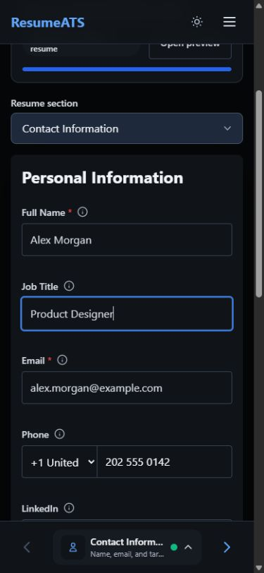
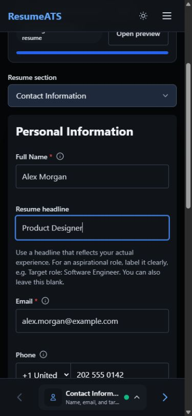
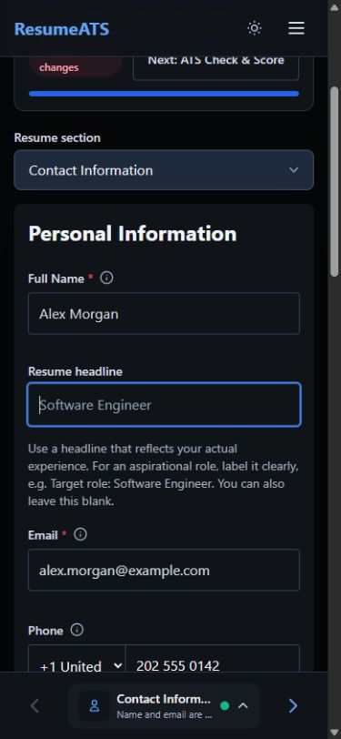
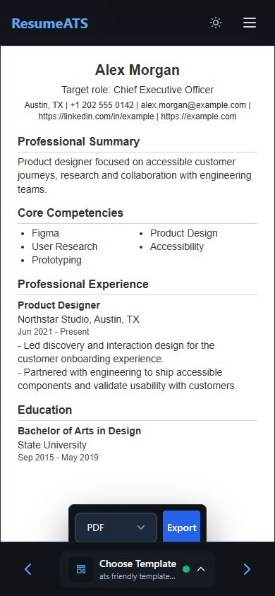
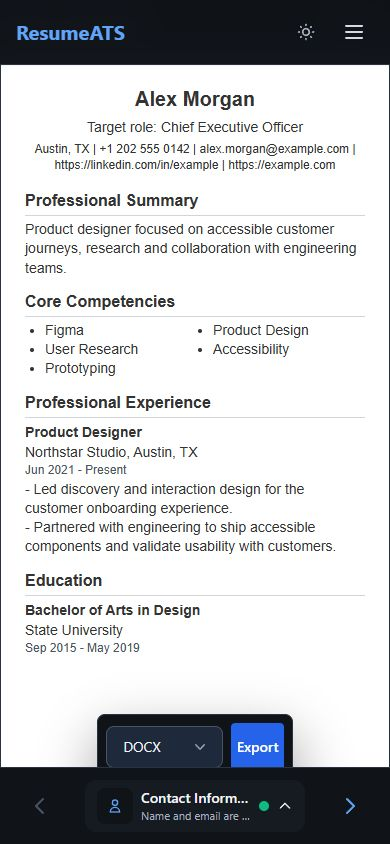
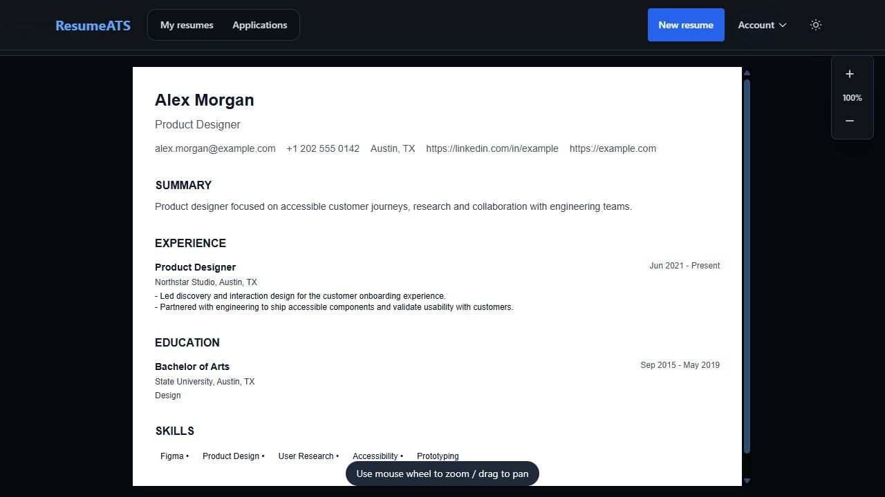
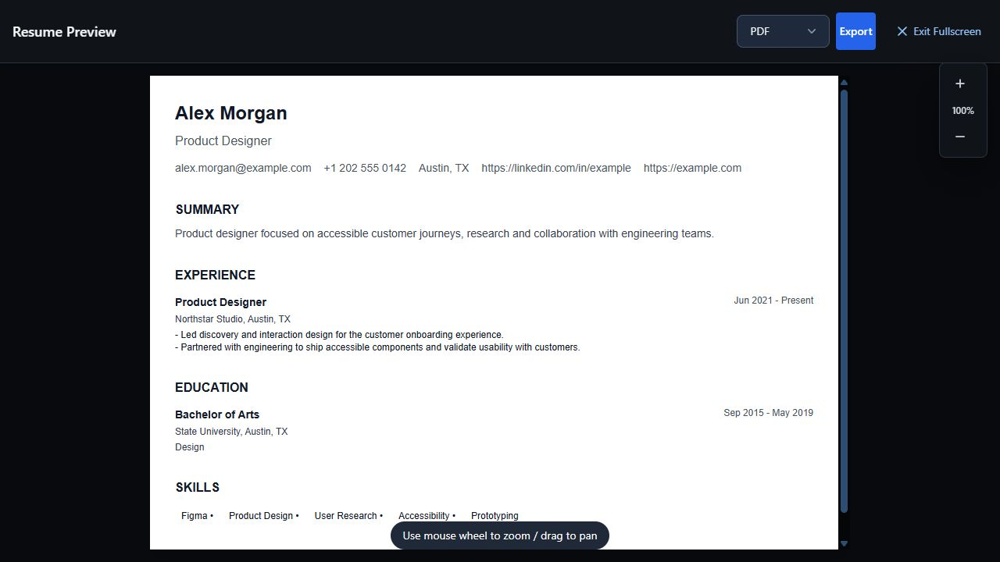
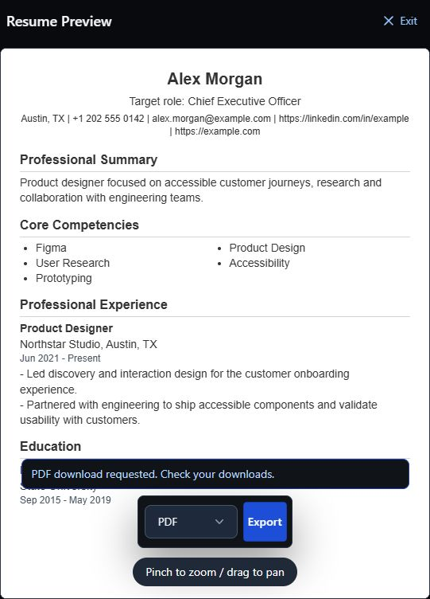
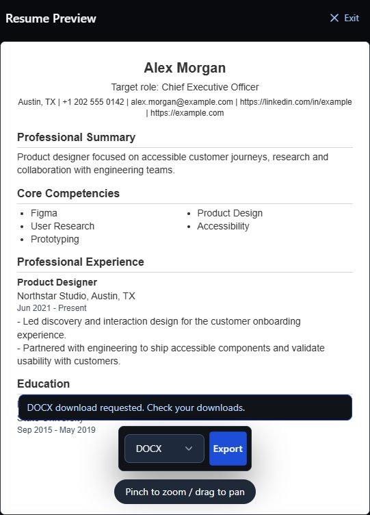

# Candidate headline and vacancy requirements pass

This local pass separates a target job from a claimed professional title, aligns
the app and extension on one conservative experience parser, and checks the
result in the editor and actual document outputs. The takeover goal remains open.

## Headline behavior

A different explicit target now produces `Target role: <target title>`. A matching
source headline retains its original wording; without an explicit parsed target,
only the source headline is retained. A model-generated title is never a fallback.
Repeated target prefixes do not accumulate, and employment titles stay unchanged.

The editor calls the field **Resume headline**, with visible, associated help
distinguishing actual experience from an aspirational role. It remains optional.
Contact completion now counts the required name and valid email, not a target
title. Explicit manual edits, including a blank headline, remain authoritative.

Independent checks found that the ATS-friendly preview omitted the headline even
though the other four templates and both document exports included it. It now
renders the same explicit field, with no fallback from resume filenames or other
metadata. Service-to-review, all-five-template, native DOCX XML and saved-extension
artifact tests cover the same contract.

The dashboard checklist also preserves the headline verbatim. It no longer adds
another `Target role:` prefix to an already-labeled target or turns an ordinary
manual headline into an inferred target. Two real-component regressions failed
before the one-line consumer correction and pass afterward.

## Shared vacancy experience parsing

`browser-agent/vacancy-experience.js` is the single source used by the app and
classic extension content script. The manifest loads the frozen, non-enumerable
namespaced API before its consumer. No network import, generated duplicate or new
dependency is needed. Both packaged extensions contain the exact source bytes;
unpacked load order and execution in the minified application build are tested.

Recognized ranges use the lower bound. Preferred requirements, company background
and collective experience are excluded. Zero is preserved. Multiple separate
scopes, reversed ranges and unsupported/upper-bound-only claims stay unknown
instead of being collapsed into a maximum. Required text and qualifiers remain
available to the app. This is bounded English extraction, not general language
understanding or a qualification verdict. Candidate-duration handling and the
overall fit-score weights are unchanged.

The original 24 independent vacancy cases went from 7 passing to 24. A follow-up
added five reproduced company-context failures and a candidate-addressed control;
all 30 now pass. The combined focused parser group contains 110 passing tests.

## Browser and document evidence

The actual loopback app and synthetic account were inspected with the permitted
in-app browser. No paid AI, employer, production database or external provider was
used. Screenshots were opened and reviewed, not only saved.

| Editor before | Editor after |
| --- | --- |
|  |  |

At 390 by 844, the help wraps without horizontal page overflow. Clearing the field
with a real Backspace event leaves it empty, removes the target from preview,
and retains 100% foundation completion for the otherwise complete fixture.
The first automation attempt to fill an empty string only selected the existing
text; that attempt was rejected as evidence and the captured state was replaced
after an actual deletion.

The ATS preview visibly distinguishes the target from the unchanged Product
Designer employment entry. During live development a hot reload restored the
unsaved local draft; this is not a native-browser download or extension test.

The actual PDF and DOCX builders produced three synthetic fixture pairs: an Intern
targeting CEO, a manual headline and a blank headline with misleading root metadata.
All six one-page outputs passed text/XML checks and every page was visually
inspected. DOCX was rendered with the canonical renderer and LibreOffice.
See [export verification](headline-export-verification.md) for reproducible local
evidence and format limits.

The browser PDF action returned the app's success toast and re-enabled controls.
A DOCX selection/action was also exercised, but neither a download event nor a
matching file in the Windows Downloads folder was confirmed. Therefore file
delivery remains unverified. The local fixture request log contains no new save
RPC or Storage upload from these unsaved-draft exports; its three saved resumes
remain at revision 1. No user document was overwritten.

## Fullscreen follow-up

Live inspection found a separate blocker: both fullscreen previews render inside
a sticky ancestor below the app's fixed header. At the Exit button's center,
hit testing reached the app header instead of the button. Mobile capture is
390 by 844; desktop is 1280 by 720. This is a confirmed interaction defect, not
merely a visual preference.

| Mobile before | Desktop before |
| --- | --- |
|  |  |

Both wrappers now use a body-portal native modal dialog, placing the toolbar in
the browser top layer rather than trying to outbid an ancestor stacking context.
Opening focuses Exit, the background is inert, and closing restores the previous
body scroll setting and the visible opener. Breakpoint changes close the obsolete
wrapper; opening during an export is disabled. Native dialog lifecycle, breakpoint,
cleanup and account/run boundaries have focused tests.

| Desktop before, 1280 by 720 | Desktop final, 1280 by 720 |
| --- | --- |
|  |  |

These matched desktop images were inspected together. Exit is visible and its
center now hit-tests to the button. The resume layout is unchanged. Live Escape
checks on desktop and mobile close the dialog, restore the empty body-overflow
setting and return focus to View fullscreen. Tab boundary probes did not enter
background page controls; focus could enter browser chrome, so this is not a claim
that every Tab always remains a DOM descendant of the dialog.

The later mobile browser viewport was 541 by 752, not the original 390 by 844.
Its after image is additional responsive/interaction evidence, **not** a matched
390px before/after comparison. No undocumented resize API or unapproved direct
Playwright tool was used to conceal that limitation.

Both actual export actions display an in-modal status, re-enable Export and keep
the modal scroll lock. Success now says `PDF/DOCX download requested. Check your
downloads.` It does not claim confirmed delivery. A shared feedback view uses
`role=status` for success and `role=alert` for failure. Account/resume changes,
unmount and obsolete runs cannot publish stale feedback; failures retain their
message and enable retry. These failure/race paths have component tests. A later
[local-only export pass](legacy-pdf-containment.md) also exercised a real unsupported
PDF glyph error and DOCX retry inside the modal. The previous global toast alone was
insufficient because it rendered below the native modal top layer.

## Verified checkpoint

The combined source at this checkpoint passes **960/960 Node tests**, zero
skipped, lint, TypeScript, build/prerender (1,207 modules), repository/diff checks
and Chrome/Firefox packaging. The 37 focused fullscreen/feedback tests are part
of that total. The initial production import graph is 676,463 raw / 202,404 gzip
bytes across seven chunks; all 60 JS chunks and two CSS/font assets were matched
to the build. See [production loading](production-loading.md). These are local
code and byte-count results, not device-speed or installed-extension certification.

## Remaining limits

- The unchanged semantic corpus still has 23 passes and seven unsafe proposals.
  Its parsed output exactly matches the prior quantity-pass snapshot. All seven
  faithful controls remain available and source-only materialization excludes all
  23 unsupported probes. These headline/parser changes do not solve semantic truth.
- PDF uses a standard Letter layout while the selected preview and DOCX can have
  different typography, section order and page size. Preview/export parity or clear
  disclosure is still required; the headline check does not certify layout parity.
- Native Word, browser filesystem delivery, installed Chrome/Firefox extension
  journeys, managed backend and provider sandboxes remain separate gates.
- The separate [legacy PDF consumer audit](legacy-pdf-consumers.md) confirms that
  clean exports and legacy profile sync can overwrite an unversioned cloud PDF,
  and the callable Gmail API prefers it without checking revision. The current
  selected-resume extension flow renders its own revision-bound artifact and
  does not consume this cache. Containment is the next pass, not part of the
  960-test checkpoint. The old email fallback is also destructive and must not
  simply be promoted to primary rendering.

Nothing has been committed, published or deployed.
