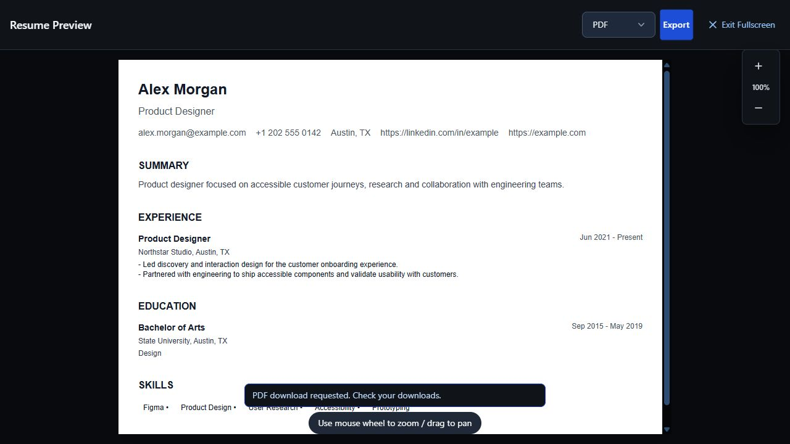
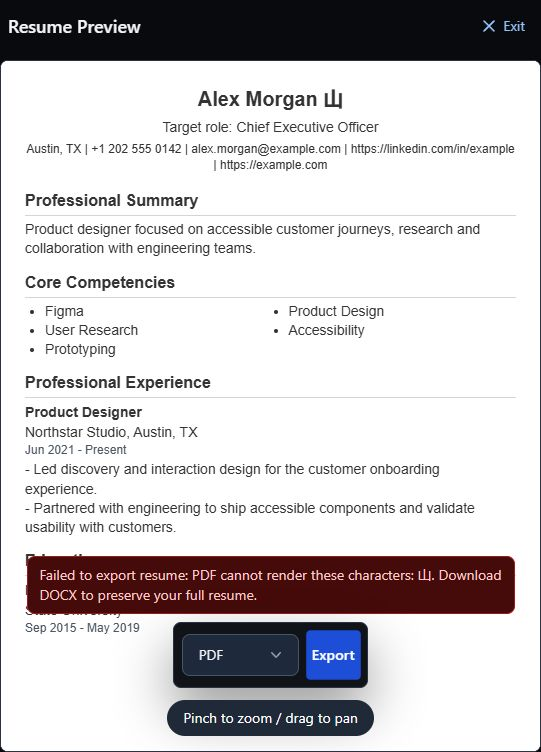
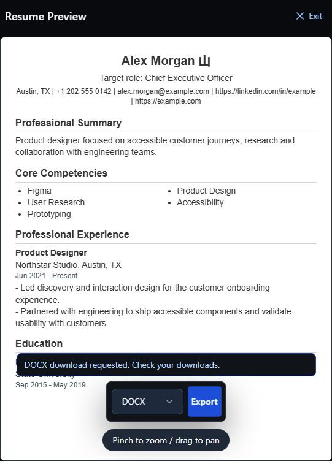

# Legacy cloud PDF containment

This is a local writer-containment pass, not the completion of the email attachment
repair. The [original consumer audit](legacy-pdf-consumers.md) remains the baseline.
The takeover goal and release gate remain open. No cloud files were deleted, no
email was sent, and nothing was deployed.

## Ordinary downloads are local-only

`downloadResumePdf` now validates the committed resume, renders it and requests a
local download. It no longer imports/initializes Supabase, checks Auth or writes
Storage. The unused explicit `uploadResumePdfToStorage` export and its helpers were
removed after confirming there were no production callers. Four existing callers
no longer pass an obsolete storage-owner argument; their account/run lifecycle
guards remain. The preview passes its exact current snapshot without stripping
the ID merely to avoid an upload.

The renderer, Unicode handling, pagination, filenames and error propagation are
unchanged. An already-started local render may finish after a session switch; it
cannot choose a new Storage owner or write any cloud PDF. This is not a claim that
an accepted browser download can be recalled.

Eight delivery tests cover clean and stale saved revisions, drafts, absent/foreign
owners, signed-out/render-time account changes, exact render/dispatch errors,
pending review rejection and absence of Supabase initialization. Six failed on
the old implementation; all eight pass. The focused caller/sink/feedback and real
in-memory PDF/DOCX group contains 89 passing tests.

## Actual app check

The desktop loopback app at 1280 by 720 displayed **Working from saved resume** for
the synthetic revision-1 resume. Exporting PDF from fullscreen returned the visible
request status and re-enabled controls. Before/after fixture request logs showed
zero Storage calls and no new save RPC; all three saved resumes retained revision 1
and their prior update timestamps. No real account or managed backend was involved.

Browser filesystem delivery remains unverified. The message is deliberately
`PDF download requested. Check your downloads.`, not proof that a file arrived.

## Failure and recovery inside fullscreen

With autosave off, the mobile synthetic name was temporarily changed from
`Alex Morgan` to `Alex Morgan 山`. The actual PDF renderer rejected the unsupported
glyph. The exact error remained visible inside the native modal as an alert,
with Export and Exit enabled. The text was not silently stripped.

| PDF failure, 541 by 752 | DOCX retry, same viewport and content |
| --- | --- |
|  |  |

The images were opened and inspected. Switching to DOCX and retrying replaced the
error with its request status while preserving the character in preview. This
checks the real action and UI recovery, not delivery or inspection of that browser
download. The pointer Exit button then closed the modal, restored page scrolling
and returned focus to View fullscreen. The temporary name was restored to
`Alex Morgan`; autosave remained off and the saved record was unchanged.

## Profile sync is document-free

`buildBrowserAgentProfile` no longer accepts an option that can create a PDF. It
always returns `documents: {}`, including when an obsolete caller supplies default,
false or true legacy options. App sync strips stale document metadata without
mutating its input, returns only the selected resume ID/title and rechecks the
account before disclosure. Pending-login sync explicitly requests a profile-only
payload for compatibility with an older app build.

The installed extension now strips legacy documents on every cached profile read,
write and disclosure boundary. Its cleanup re-reads inside the existing serialized
state queue before writing, so an earlier cache read cannot replace a newer
account, queue or job state. Obsolete PDF-readiness fields are gone from the state
summary. Install/update migration uses the same queue and latest-state read; a
reproduced overlap confirms an update cannot restore legacy metadata or overwrite
a concurrently replacing account and job queue. The separate session-only,
owner/job/revision-bound selected-resume
artifact remains unchanged; it does not use `profile.documents`.

Nine baseline builder/app-sync cases reproduced seven legacy preparations or stale
metadata disclosures on the old source. All nine now pass. Installed-runtime tests
exercise cached-document cleanup, the serialized account/queue race, authenticated
refresh, explicit sync and disclosure. The Stage A + B implementation checkpoint
passes **987/987 Node tests**, zero skipped, global ESLint, TypeScript, all
Supabase function typechecks, production build/prerender (1,210 modules),
repository/diff checks and both Chrome/Firefox package builds. The strict
diagnostic remains exactly equal to its immutable
23-pass/7-unsafe snapshot; all seven faithful controls remain available and
source-only output includes zero unsupported probes.

The new [asset snapshot](production-loading-after-legacy-pdf-containment.json)
matches all 60 JS chunks and two CSS/font assets to the actual build. Initial
loading is 676,463 raw / 202,400 gzip bytes across seven chunks: unchanged raw and
four gzip bytes lower than the 960-test fullscreen checkpoint. Across every JS
chunk, the pass removes 2,679 raw / 952 gzip bytes, including obsolete browser
profile PDF and Storage code. These are byte counts, not device-speed claims.

## Version-bound email attachments

The callable auto-apply path now uses the [implemented version-bound plan](legacy-email-pdf-plan.md):
`resumeAttachment.ts` creates a caller-authorized reader around
`get_resume_versioned`, freezes one snapshot, and derives the cover-letter text
and Unicode/paginated PDF package from that snapshot. The handler contains no
Storage download, no raw one-page generator, and no attachmentless Gmail
fallback. Outreach without a selected resume fails before discovery or paid
generation; discovery-only without a resume remains available. Before each
provider call, owner/id/revision are revalidated; a changed selection marks the
current job failed, fails the run, and releases the lease.

`tests/backendResumeAttachment.test.js` and `tests/legacyResumeAttachment.test.js`
cover the guarded handler and package boundaries. The function-local Deno check
read the packaged font and rendered three pages while preserving Unicode, all 90
negative-quantity occurrences and the final sentinel; all three pages were
visually inspected. The managed Supabase/Docker packaging gate is still open
because Docker is unavailable on this host. A database edit after an external
email request begins cannot retract that request; no atomic-send guarantee is
proposed.
