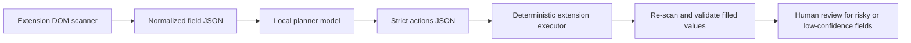

# ResumeATS Autofill Field Planner Training

This folder is a local fine-tuning kit for an autofill planner model. The model does not directly click or type in the browser. It receives normalized form fields from the extension and returns a strict JSON plan. The extension should still execute the plan deterministically, validate the result, and ask the user to review low-confidence answers.

No model will be 100% accurate across every job board. The realistic SOTA target is:

1. deterministic rules for obvious fields,
2. a trained planner for ambiguous labels, dropdowns, and text questions,
3. strict validation before filling,
4. human review for legal, demographic, salary, clearance, and low-confidence answers.

## Architecture



The model should only answer this question: "Given the profile, job, page, and fields, what value should each field receive?"

It should not control the browser directly. Browser control should stay in the extension so you can validate exact dropdown options, file uploads, checkboxes, and page state.

## Folder Layout

- `data/examples.jsonl` - starter supervised fine-tuning examples.
- `data/sample-input.json` - one inference payload for testing a trained adapter.
- `schema/action.schema.json` - expected dataset/action shape.
- `scripts/validate_dataset.py` - dataset quality checks.
- `scripts/train_qlora.py` - QLoRA supervised fine-tuning script.
- `scripts/infer_planner.py` - one-shot local inference from a JSON file.
- `scripts/serve_planner.py` - local FastAPI server for extension integration.

## Hardware

Your RTX 3080 10 GB is enough to fine-tune a small instruct model with QLoRA. Start with:

- `Qwen/Qwen2.5-1.5B-Instruct` for the first working version.
- `Qwen/Qwen2.5-3B-Instruct` once the dataset is good.

Do not train from scratch. Training from scratch needs a large dataset, many GPUs, and a budget that is not justified for this task. Fine-tuning a strong small model is the correct path.

## WSL2 Setup

Use WSL2 Ubuntu for training. Native Windows can work, but CUDA Python packages are less predictable.

```powershell
wsl --install -d Ubuntu-24.04
```

Open Ubuntu, then verify the GPU:

```bash
nvidia-smi
```

Install system dependencies:

```bash
sudo apt update
sudo apt install -y python3.11-venv git build-essential
```

Create the Python environment:

```bash
cd "/mnt/c/Users/Administrator/Desktop/OG Websites/ats-friendly-resume-builder/training/autofill-field-planner"
python3 -m venv .venv
source .venv/bin/activate
python -m pip install --upgrade pip
pip install -r requirements.txt
```

If Ubuntu asks for a sudo password and `python3 -m venv` fails because `ensurepip` is unavailable, use a user-level virtualenv instead:

```bash
cd /tmp
python3 - <<'PY'
from urllib.request import urlretrieve
urlretrieve('https://bootstrap.pypa.io/get-pip.py', 'get-pip.py')
PY
python3 /tmp/get-pip.py --user --break-system-packages
~/.local/bin/pip install --user --break-system-packages virtualenv
~/.local/bin/virtualenv ~/.venvs/resumeats-autofill
source ~/.venvs/resumeats-autofill/bin/activate
cd "/mnt/c/Users/Administrator/Desktop/OG Websites/ats-friendly-resume-builder/training/autofill-field-planner"
pip install -r requirements.txt
```

Check CUDA from PyTorch:

```bash
python -c "import torch; print(torch.cuda.is_available(), torch.cuda.get_device_name(0))"
```

Expected result: `True` and your RTX 3080 name.

## Dataset Format

Each JSONL line is one supervised example:

```json
{
  "id": "sponsorship-select-basic",
  "input": {
    "profile": {},
    "job": {},
    "page": {},
    "fields": []
  },
  "output": {
    "actions": [],
    "notes": []
  }
}
```

The important part is `input.fields`. Each field should include as much DOM context as the extension can safely collect:

- `fieldId`
- `label`
- `kind`
- `required`
- `placeholder`
- `options`
- `section`
- `name`
- `id`
- `currentValue`

For selects, radios, and choice fields, the output `optionText` must exactly match one of the provided `options`.

## What To Collect

Start by creating examples from real applications. The dataset should include both successful fills and cases where the model should skip.

Good first milestone:

- 200 examples: smoke test only.
- 1,000 examples: useful first adapter.
- 5,000+ examples: strong planner if examples are clean and diverse.

Collect examples for:

- text inputs: name, email, phone, city, LinkedIn, GitHub, portfolio,
- dropdowns: country, work authorization, sponsorship, notice period, work setup,
- radios/checkboxes: remote/hybrid/on-site, terms confirmation, relocation,
- textareas: why this role, cover-letter short answer, relevant experience,
- file fields: resume and cover letter references only,
- skip cases: clearance, disability, veteran, gender, race, salary, unknown legal answers.

Do not train it to invent sensitive answers. If the profile does not explicitly answer a legal, demographic, security, or salary question, the target output should be `skip: true`, empty value, and `confidence: "low"`.

## Capture Corrections From The Training Extension

Use the separate Chrome extension folder:

```text
browser-agent-training
```

Load it from `chrome://extensions` with Developer mode -> Load unpacked. This is a copy of the production browser agent with separate storage keys and a bottom-right "Autofill Trainer" correction panel.

Workflow:

1. Run Autofill from the trainer extension.
2. Correct any wrong fields manually.
3. Click "Save corrections" in the trainer panel.
4. The local trainer API appends examples to:

```text
data/captured-examples.jsonl
```

Then validate and train:

```bash
python -m scripts.validate_dataset data/captured-examples.jsonl --min-rows 10
```

`data/captured-examples.jsonl` is ignored by git because it can contain personal profile data.

## Validate Data

Run this before every training run:

```bash
python -m scripts.validate_dataset data/examples.jsonl --min-rows 1
```

For your real dataset:

```bash
python -m scripts.validate_dataset data/my-real-examples.jsonl --min-rows 200
```

Warnings are useful. Errors must be fixed.

## Train

First training run on the starter data:

```bash
python -m scripts.train_qlora \
  --dataset data/examples.jsonl \
  --model Qwen/Qwen2.5-1.5B-Instruct \
  --output-dir runs/qwen2.5-1.5b-autofill-lora \
  --epochs 5 \
  --max-length 1536
```

The script defaults to stable FP32 LoRA training on top of a 4-bit base model. Add `--fp16` only after a smoke run passes on your exact PyTorch/CUDA stack.

Real training run after you collect examples:

```bash
python -m scripts.train_qlora \
  --dataset data/my-real-examples.jsonl \
  --model Qwen/Qwen2.5-1.5B-Instruct \
  --output-dir runs/qwen2.5-1.5b-autofill-lora \
  --epochs 3 \
  --max-length 1536 \
  --save-steps 100
```

If 1.5B is stable and accuracy is limited by reasoning, try 3B:

```bash
python -m scripts.train_qlora \
  --dataset data/my-real-examples.jsonl \
  --model Qwen/Qwen2.5-3B-Instruct \
  --output-dir runs/qwen2.5-3b-autofill-lora \
  --epochs 3 \
  --max-length 1280 \
  --gradient-accumulation-steps 24
```

If you get CUDA out-of-memory:

- reduce `--max-length` to `1024`,
- keep `--batch-size 1`,
- increase `--gradient-accumulation-steps`,
- close browsers and other GPU apps,
- train the 1.5B model first.

## Test One Input

```bash
python -m scripts.infer_planner \
  --model Qwen/Qwen2.5-1.5B-Instruct \
  --adapter runs/qwen2.5-1.5b-autofill-lora \
  --input data/sample-input.json
```

Expected output shape:

```json
{
  "actions": [
    {
      "fieldId": "field-1",
      "value": "No",
      "optionText": "No",
      "confidence": "high",
      "source": "explicit_profile"
    }
  ],
  "notes": []
}
```

## Run Local Server

```bash
AUTOFILL_ADAPTER_DIR=runs/qwen2.5-1.5b-autofill-lora \
uvicorn scripts.serve_planner:app --host 127.0.0.1 --port 8787
```

Open the local dashboard:

```text
http://127.0.0.1:8787/dashboard
```

The dashboard shows:

- CUDA/model health,
- current training state,
- live training logs,
- a loss chart from `--metrics-jsonl`,
- controls to start or stop a local training run.

When training starts from the dashboard, the server unloads the inference model first so the RTX 3080 has more free VRAM for fine-tuning.

Health check:

```bash
curl http://127.0.0.1:8787/health
```

Planner request:

```bash
curl -X POST http://127.0.0.1:8787/plan \
  -H "Content-Type: application/json" \
  --data @data/sample-input.json
```

## Extension Integration Plan

Add this after the model is trained and tested:

1. Add an extension setting: `localPlannerUrl`, default empty.
2. Let the content script build normalized `fields` in the same shape used by the dataset.
3. Send only the required profile/job/field payload to `http://127.0.0.1:8787/plan`.
4. Execute only validated actions:
   - field exists,
   - field type matches,
   - option text exactly matches available option,
   - confidence is high or the user approved it,
   - sensitive answers came from explicit profile data.
5. Re-scan the page after filling and show unresolved fields to the user.

That gives you the best practical accuracy: model intelligence for interpretation, deterministic browser logic for execution, and review for anything risky.

## References

- Hugging Face TRL SFT Trainer: https://huggingface.co/docs/trl/sft_trainer
- Hugging Face PEFT LoRA: https://huggingface.co/docs/peft
- Hugging Face bitsandbytes quantization: https://huggingface.co/docs/transformers/quantization/bitsandbytes
- NVIDIA CUDA on WSL: https://docs.nvidia.com/cuda/wsl-user-guide/index.html
